# NutriScanPro - Smart Nutrition Tracking App

A beautiful, cross-platform mobile application for intelligent nutrition tracking built with Expo and React Native. Track your meals through barcode scanning, photo analysis, or text descriptions with AI-powered food recognition.

---

## 📸 App Screenshots

### 🔐 Authentication & Home

<p align="center">
  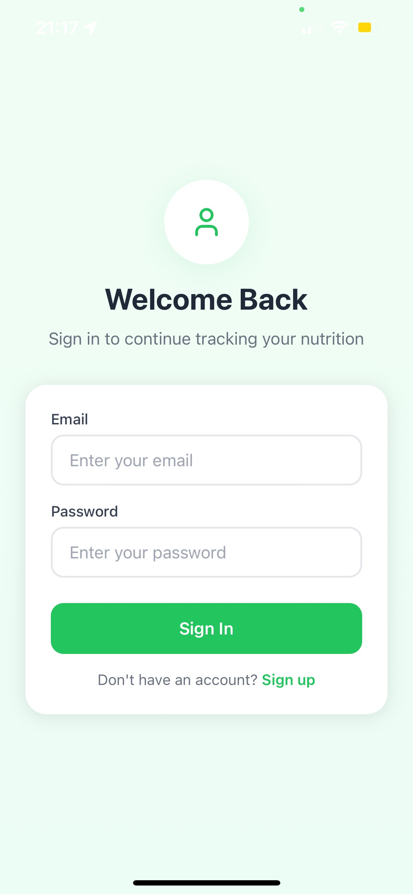
  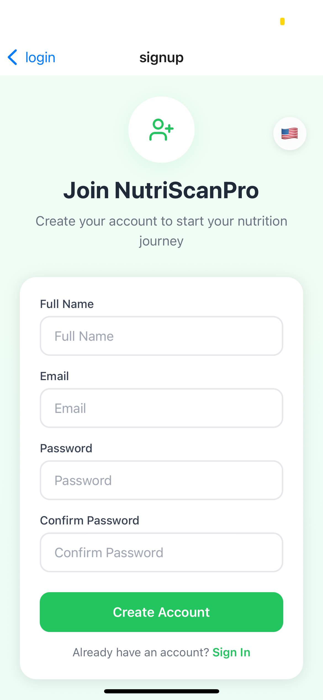
  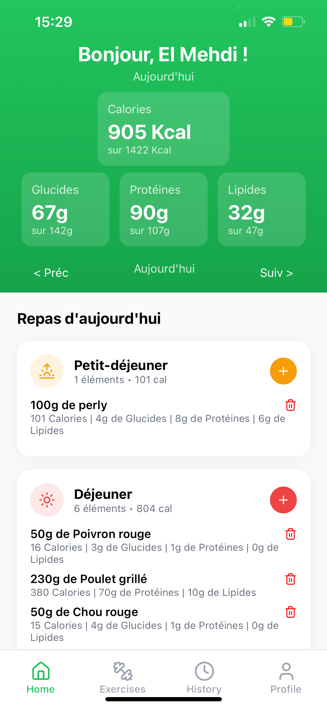
</p>

### 🍽️ Adding Meals

<p align="center">
  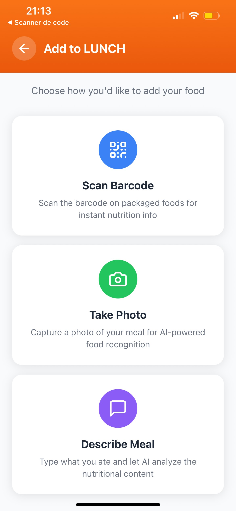
</p>

<p align="center">
  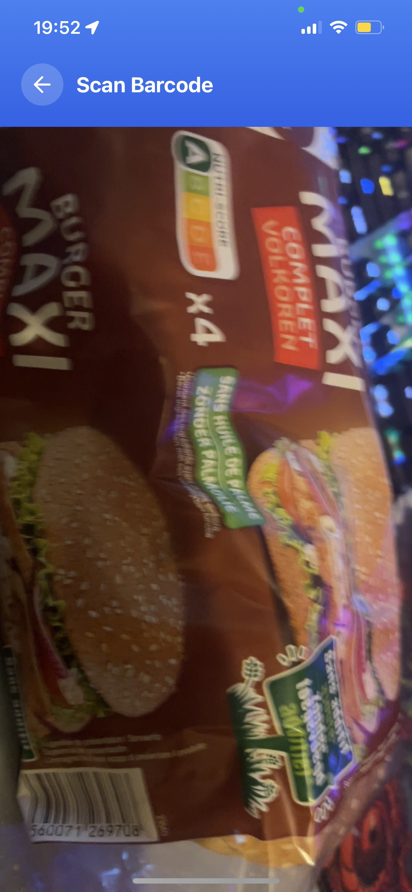
  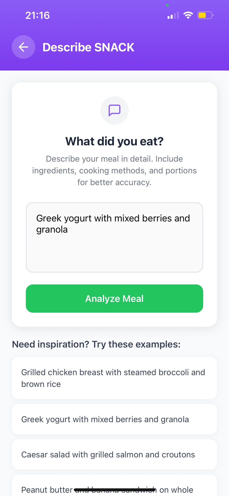
  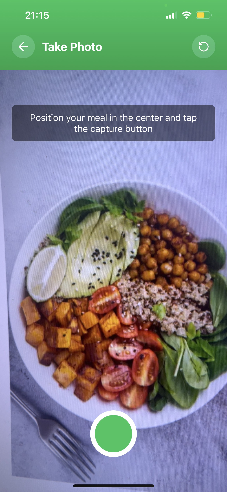
</p>

### 📊 Analysis Results

<p align="center">
  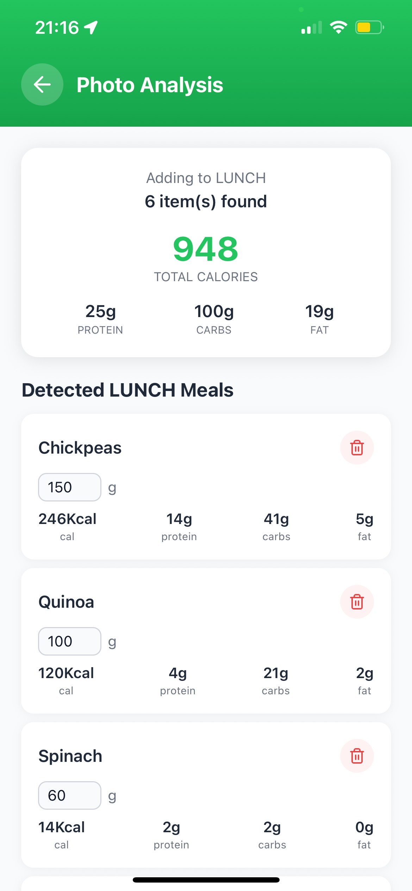
  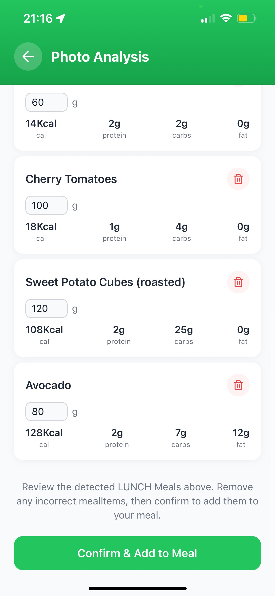
  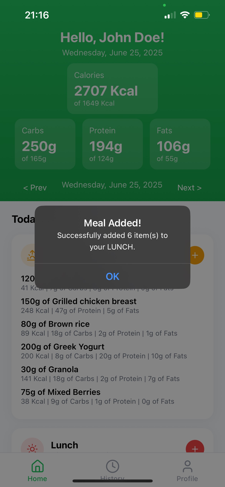
</p>

### 📆 Exercice Library & History

<p align="center">
  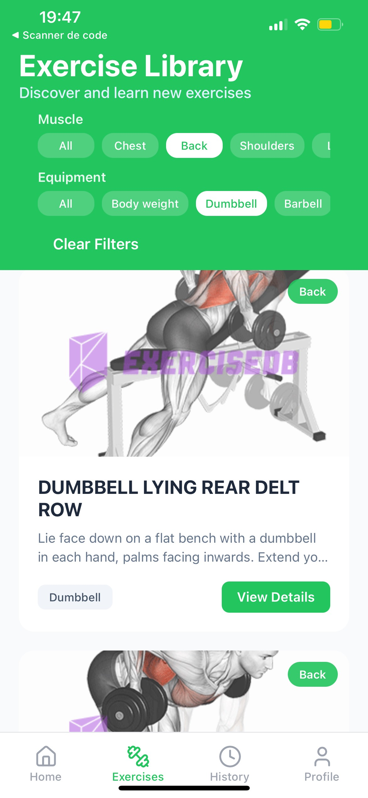
  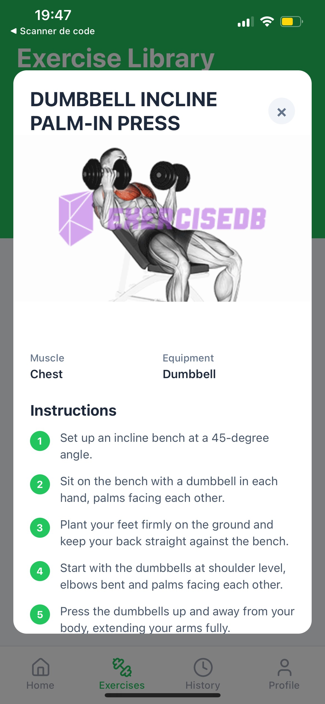
    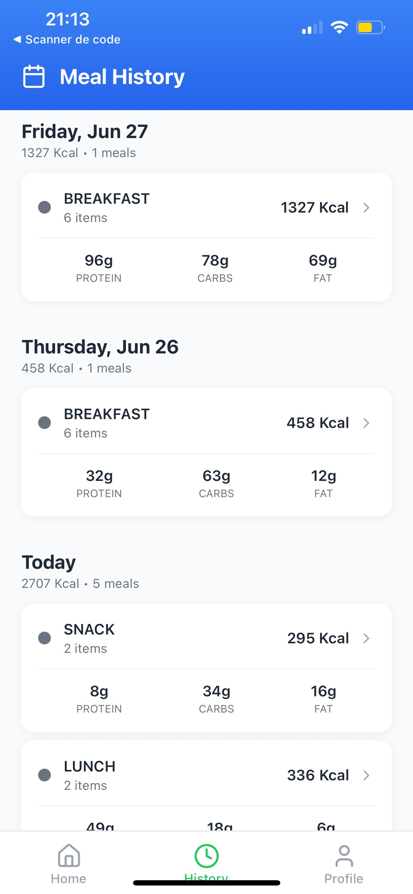

</p>

### 📆 Profile & Language Selection

<p align="center">
  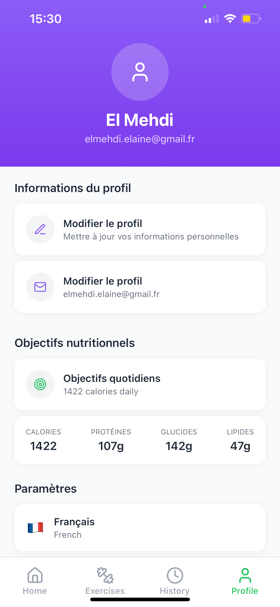
  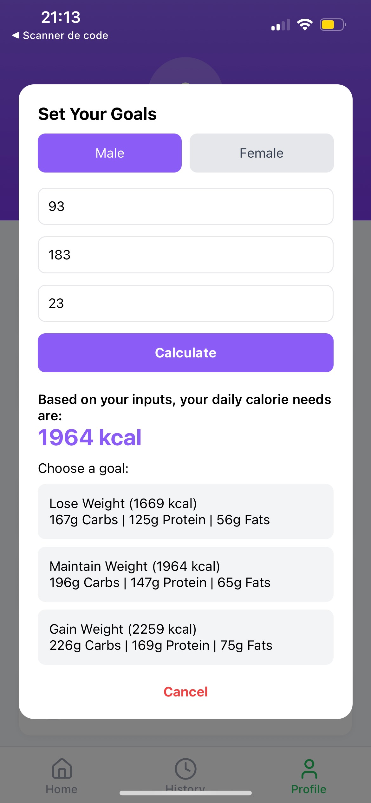
    

</p>

---
## ✨ Features

### 🍽️ Smart Meal Tracking
- **Barcode Scanning**: Instantly add packaged foods by scanning their barcodes
- **Photo Analysis**: Take photos of your meals for AI-powered food recognition
- **Text Description**: Describe what you ate and let AI analyze the nutritional content
- **Multiple Meal Types**: Track breakfast, lunch, dinner, and snacks separately

### 📊 Comprehensive Analytics
- **Daily Overview**: See your total calories and macronutrients at a glance
- **Meal History**: Browse your complete nutrition history by date
- **Nutritional Goals**: Set and track your daily nutrition targets
- **Macro Breakdown**: Detailed protein, carbs, and fat tracking

### 👤 User Management
- **Secure Authentication**: JWT-based login and registration
- **User Profiles**: Manage personal information and nutrition goals
- **Data Persistence**: All your data is securely stored and synced

### 🏋️ Exercise Library
- **Browse Exercises**: Explore a comprehensive library of exercises with images, muscle groups, and equipment info
- **Filter & Search**: Filter exercises by muscle group or equipment
- **Exercise Details**: View detailed instructions and images for each exercise

### 🌐 Internationalization (i18n)
- **Multi-language Support**: The app supports multiple languages (English, French, and more coming soon)
- **Automatic Language Detection**: Detects and sets the app language based on your device settings
- **Manual Language Selection**: Easily switch languages from the profile screen
- **Persistent Language Preference**: Remembers your language choice across sessions

### 🎨 Beautiful Design
- **Modern UI**: Clean, intuitive interface with smooth animations
- **Cross-Platform**: Works seamlessly on iOS, Android, and Web
- **Responsive Design**: Optimized for all screen sizes

## 🚀 Getting Started

### Prerequisites

- Node.js (v18 or higher)
- npm or yarn
- Expo CLI
- iOS Simulator / ExpoGo Mobile App (for iOS development)
- Android Studio / ExpoGo Mobile App (for Android development)


### Installation

1. **Clone the repository**
   ```bash
   git clone https://github.com/ainemehdi6/nutriscanpro-app.git
   cd nutriscanpro-app
   ```

2. **Install dependencies**
   ```bash
   npm install
   ```

3. **Set up environment variables**
   Create a `.env` file in the root directory:
   ```env
   EXPO_PUBLIC_API_URL=https://nutriscanpro-api.onrender.com/api
   ```
   or use clone the api https://github.com/ainemehdi6/nutriscanpro-api on your local 

4. **Start the development server**
   ```bash
   npm run dev
   ```
   or for Windows use
   ```bash
   npm run dev:win
   ```
   


5. **Run on your preferred platform**
   - Press `i` for iOS Simulator
   - Press `a` for Android Emulator
   - Press `w` for Web Browser
   - Scan QR code with Expo Go app for physical device

## 📱 Platform Support

| Platform | Status | Notes |
|----------|--------|-------|
| iOS | ✅ Full Support | Camera, barcode scanning, all features |
| Android | ✅ Full Support | Camera, barcode scanning, all features |
| Web | ✅ Full Support | Camera, barcode scanning, all features |

## 🏗️ Project Structure

```
nutrition-tracker/
├── app/                    # App routes (Expo Router)
│   ├── (tabs)/            # Tab navigation screens
│   │   ├── index.tsx      # Home screen
│   │   ├── history.tsx    # Meal history
│   │   ├── profile.tsx    # User profile
│   │   └── exercises.tsx  # Exercise Library screen
│   ├── add-meal/          # Add meal flow
│   │   ├── index.tsx      # Method selection
│   │   ├── barcode.tsx    # Barcode scanner
│   │   ├── camera.tsx     # Photo capture
│   │   ├── description.tsx # Text input
│   │   └── results.tsx    # Analysis results
│   ├── auth/              # Authentication screens
│   │   ├── login.tsx      # Login screen
│   │   └── signup.tsx     # Registration screen
│   └── _layout.tsx        # Root layout
├── components/            # Reusable components
│   ├── Button.tsx         # Custom button component
│   ├── Input.tsx          # Custom input component
│   ├── LoadingScreen.tsx  # Loading indicator
│   └── LanguageSelector.tsx # Language selection component (i18n)
├── hooks/                 # Custom React hooks
│   ├── useAuth.ts         # Authentication hook
│   ├── useFrameworkReady.ts # Framework initialization
│   └── useI18n.ts         # i18n hook
├── services/              # API and external services
│   ├── api.ts             # API service layer
│   ├── auth.ts            # Authentication service
│   └── i18n.ts            # i18n logic and language management
├── types/                 # TypeScript type definitions
│   ├── api.ts             # API response types
│   └── i18n.ts            # i18n types
├── locales/               # Translation files for i18n (en.ts, fr.ts, etc.)
├── app-screens/           # App screenshots (see Exercice_Livbrary.png, Exercice_Details.png, Language_Selection.png)
└── assets/                # Static assets
    └── images/            # App icons and images
```

## 🔧 Configuration

### Environment Variables

The app uses Expo's environment variable system. Create environment files for different stages:

- `.env` - Development defaults

Required variables:
```env
EXPO_PUBLIC_API_URL=https://nutriscanpro-api.onrender.com/api
EXPO_PUBLIC_API_KEY=your_api_key_here
```

### API Integration

The app connects to a REST API backend with the following main endpoints:

- `POST /auth/login` - User authentication
- `POST /auth/register` - User registration
- `GET /meals?page=${page}&limit=${limit}` - Get user history meals
- `GET /meals/date?date=YYYY-MM-DD` - Get user meals by date
- `GET /foods/barcode/${barcode}` - Get food by barcode
- `POST /ai-analysis/image` - Get foods by photo
- `POST /ai-analysis/text` - Get foods by description

## 🛠️ Development

### Available Scripts

```bash
npm run dev          # Start development server
npm run build:web    # Build for web production
npm run lint         # Run ESLint
```

## 📦 Dependencies

### Core Dependencies
- **Expo SDK 52.0.30** - Cross-platform development framework
- **Expo Router 4.0.17** - File-based routing system
- **React Native** - Mobile app framework
- **TypeScript** - Type safety and better development experience

---

Made with ❤️ by El Mehdi EL AINE

*Track your nutrition, transform your health!*